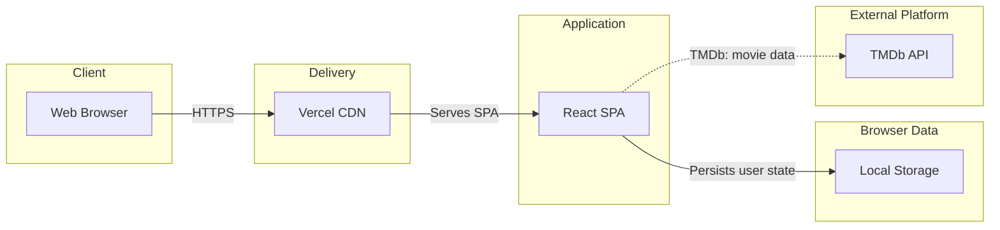

# Moviora
 — Modern Movie Discovery

[](https://github.com/Mohataseem89/Moviora
-Movie_Explorer_Web_App/actions/workflows/ci.yml)
[](https://react.dev/)
[](https://vite.dev/)
[](https://developer.themoviedb.org/)

Moviora
 is a production-minded movie discovery application built with React and the TMDb API. It turns browsing into a focused workflow: discover with shareable filters, inspect rich movie and cast details, watch trailers, and keep a persistent personal watchlist.

[View live demo](https://cine-maxapp.vercel.app/) · [Browse the source](https://github.com/Mohataseem89/Moviora
-Movie_Explorer_Web_App) · [Read the case study](docs/PORTFOLIO.md)


## Why this project matters

Moviora
 demonstrates more than API rendering. The current implementation includes route-level code splitting, a reusable request layer with caching and duplicate-request deduplication, URL-driven filter state, resilient browser persistence, dynamic page metadata, structured data, accessibility affordances, and automated regression checks.

### Product highlights

- **Discovery:** trending, now playing, genuinely upcoming, popular, and top-rated collections
- **Advanced filtering:** genre, year, minimum rating, and sort order reflected in shareable URLs
- **Rich detail pages:** trailers, cast, key crew, recommendations, similar movies, and person filmographies
- **Fast search:** debounced suggestions, keyboard navigation, recent searches, pagination, and useful empty/error states
- **Personal watchlist:** local persistence, duplicate protection, search, genre filtering, sorting, and responsive layouts
- **Polished experience:** responsive images, loading skeletons, retry states, reduced-motion support, and mobile navigation

## Engineering snapshot

These values are reproducible from the current source with `npm run check`.

| Measure | Current result |
| --- | ---: |
| Automated regression tests | 7 passing |
| Initial application JavaScript | 250.38 kB |
| Initial JavaScript, gzip | 80.27 kB |
| Production CSS | 50.13 kB |
| Production CSS, gzip | 9.02 kB |
| Route delivery | Lazy-loaded page chunks |
| Quality gate | Lint + test + build |

Bundle values are Vite production output, not synthetic Lighthouse scores. See [Testing and quality](docs/TESTING.md) for the verification scope.

## Architecture



The application intentionally has no custom backend or account system. Watchlists and search history stay on the current device, keeping the portfolio scope focused on frontend architecture and product quality. A serverless API proxy is the appropriate next step if traffic or credential controls require it. See the [architecture document](docs/ARCHITECTURE.md).

## Technology

| Technology | Responsibility |
| --- | --- |
| React 19 | Component UI and client state |
| React Router 7 | Routes, URL state, and navigation |
| Tailwind CSS 4 | Design system and responsive layout |
| Vite 7 | Development, code splitting, and production builds |
| Lucide React | Consistent interface iconography |
| TMDb API | Movie, person, image, and video data |
| Node test runner + ESLint | Regression checks and static analysis |
| Vercel | Static delivery, SPA rewrites, caching, and headers |

## Local development

### Requirements

- Node.js 20 or newer
- A [TMDb API key](https://developer.themoviedb.org/docs/getting-started)

```bash
git clone https://github.com/Mohataseem89/Moviora
-Movie_Explorer_Web_App.git
cd Moviora
-Movie_Explorer_Web_App
npm install
cp .env.example .env
npm run dev
```

Add the key to `.env`:

```env
VITE_TMDB_API_KEY=your_tmdb_api_key
```

Do not commit `.env`. Variables prefixed with `VITE_` are embedded in the browser bundle; this setup is suitable for a restricted TMDb key and a portfolio deployment, not for a secret server credential.

## Commands

| Command | Purpose |
| --- | --- |
| `npm run dev` | Start the Vite development server |
| `npm run lint` | Run ESLint |
| `npm run test` | Run Node regression tests |
| `npm run build` | Create a production build |
| `npm run check` | Run lint, tests, and production build |
| `npm run preview` | Preview the production build locally |

## Project map

```text
src/
├── api/          # TMDb request client, caching, deduplication, image URLs
├── components/   # Reusable UI and route-level feature components
├── hooks/        # Page metadata and watchlist state
├── pages/        # Home, discover, search, person, and not-found routes
├── utils/        # Safe persistence and domain helpers
├── App.jsx       # Routing, shared watchlist actions, global feedback
└── main.jsx      # Application entry and global error boundary
tests/            # Browser-storage regression tests
public/           # Favicons, social preview, manifest, robots, sitemap
docs/             # Architecture, delivery, QA, accessibility, portfolio notes
```

## Project documentation

- [Architecture and engineering decisions](docs/ARCHITECTURE.md)
- [Deployment and release checklist](docs/DEPLOYMENT.md)
- [Testing and manual QA](docs/TESTING.md)
- [Accessibility implementation](docs/ACCESSIBILITY.md)
- [Portfolio case study and resume bullets](docs/PORTFOLIO.md)
- [Screenshot capture guide](docs/SCREENSHOTS.md)
- [Contributing guide](CONTRIBUTING.md)
- [Release history](CHANGELOG.md)

## Deployment

Vercel configuration is included in `vercel.json`. It provides SPA rewrites for direct route visits, immutable caching for hashed assets, caching for brand assets, and security-focused response headers. Add `VITE_TMDB_API_KEY` to the Vercel project before deploying, then follow the [deployment checklist](docs/DEPLOYMENT.md).

## Data attribution

This product uses the TMDB API but is not endorsed or certified by TMDB. Movie information and images are provided by [The Movie Database](https://www.themoviedb.org/).

## Author

**Mohataseem Khan**

[LinkedIn](https://www.linkedin.com/in/mohataseem-khan/) · [GitHub](https://github.com/Mohataseem89)


> Made with ❤️ for movie lovers.
